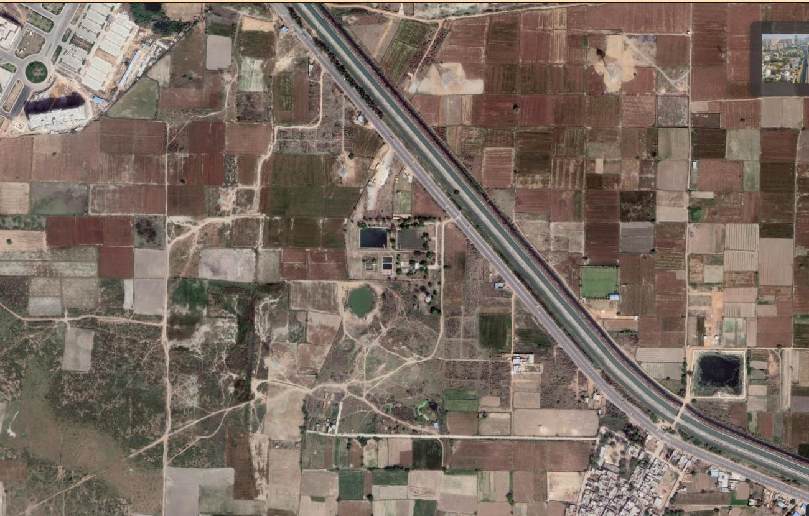
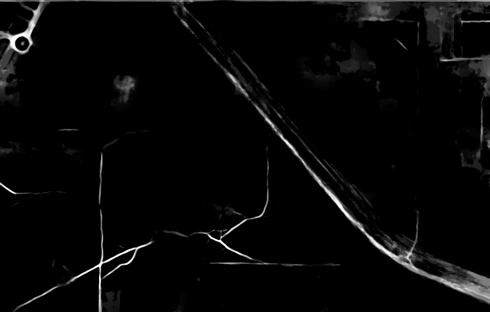
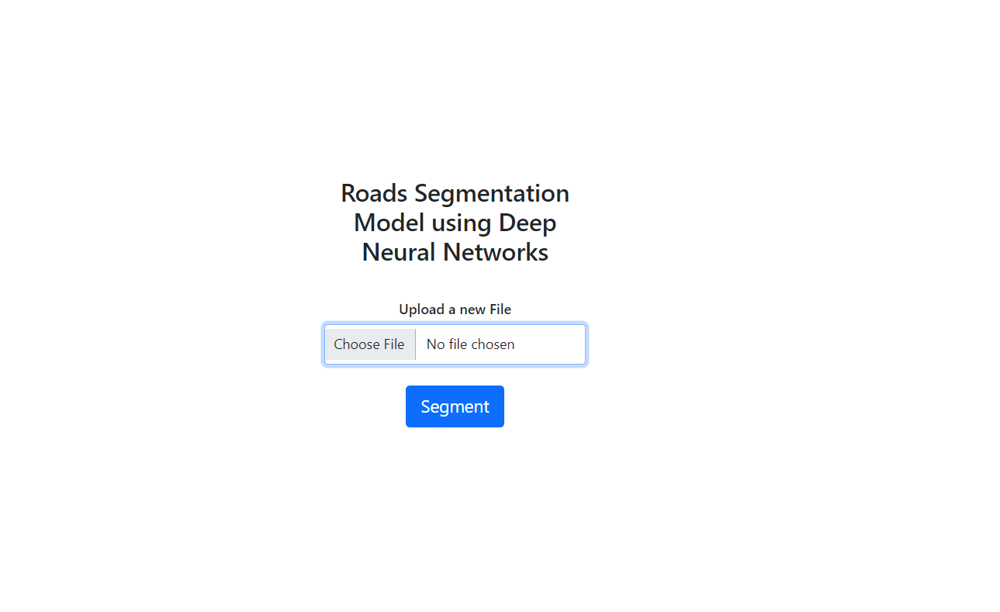
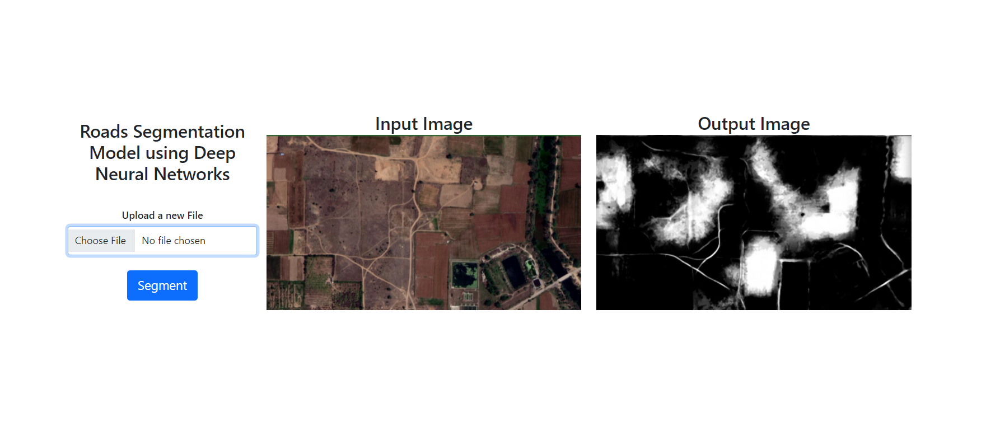

# Image Segmentation of Roads (Primary and Non - Primary) using Deep Nural Networks

This project uses Flask's abilities to create a web application that allows you to segement roads in remote sensing satellite images using deep learning and image segmentation.

## Objective

Tracking roads in satellite images is a big deal, it helps countries manage their traffic during disaster like situations, monitor illegal vehicle activities ect. One used to achieve his by getting a person to sit on the computer day in and day night, but using AI and Machine Learning this task can be done much easily these day.

## Concepts used

- Flask for model deployment
- Image segmentation using tensorflow, PIL, UNET model, etc.

## A deep dive

This GUI deploys a model trained using the UNET model to achieve image segmentation tasks, it segments out roads both asphalt and dirt using ;ixel level classification. It gives the background a pixel color of 0 and the roads a pixel color of 1.

## Screenshots

### Image Segementation

Lets say this is the input image

SO this is the output with normal roads also marked as 1 and dirt roads also marked as one

### GUI

Before any segmentation, but once you upload your image and click segment.

You can see the input image and output image side by side for easy comparison.
